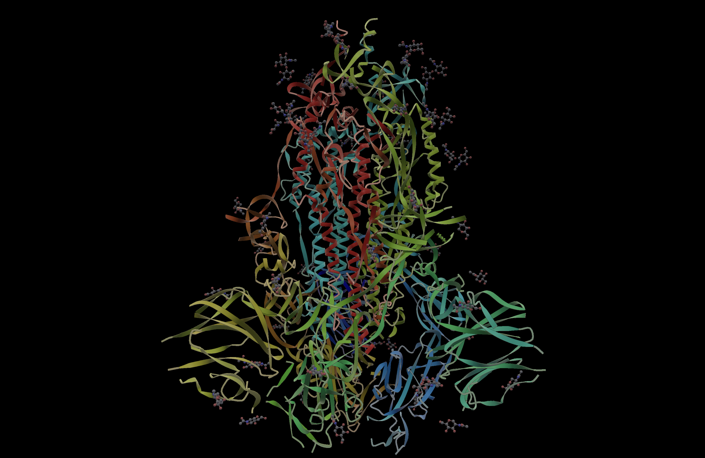
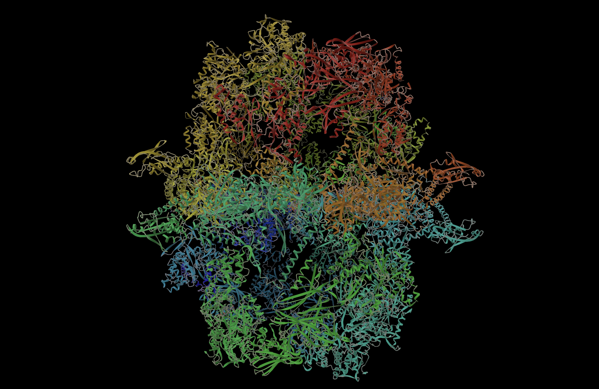
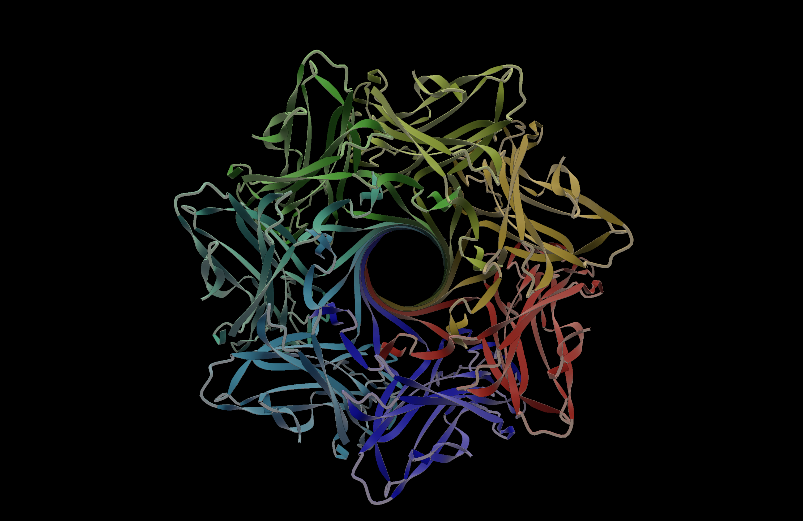
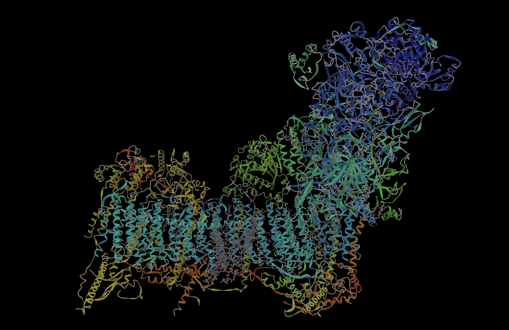
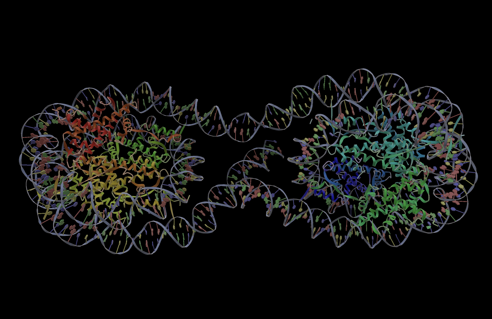
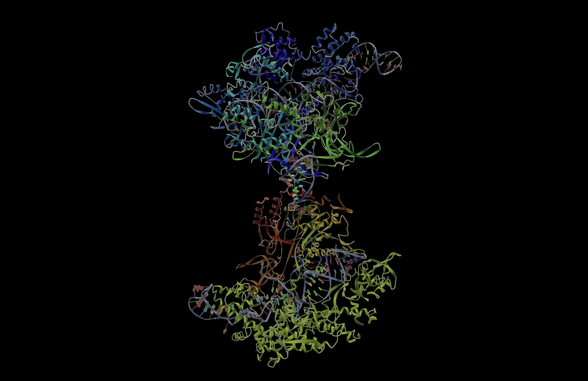

# Viso

Viso is a GPU-accelerated 3D protein visualization engine written in Rust. It renders interactive, real-time views of macromolecular structures from PDB and mmCIF files using modern WebGPU graphics via [wgpu](https://wgpu.rs/).

**[Documentation](https://petridecus.github.io/viso/)**

Viso supports multiple representation styles — backbone ribbons, tubes, ball-and-stick, sidechains, and nucleic acids — combined with a full post-processing pipeline (bloom, SSAO, FXAA, tone mapping) and an animation system for smooth structural transitions.

<p align="center">
  
  
  
</p>
<p align="center">
  
  
  
</p>

## Features

- **Multiple representations**: secondary structure ribbons (helices/sheets), backbone tubes, ray-marched sidechain impostors, ball-and-stick ligands, nucleic acid backbones
- **Post-processing pipeline**: bloom, screen-space ambient occlusion, FXAA anti-aliasing, edge outlines, tone mapping
- **Interactive camera**: arcball rotation, panning, zoom, auto-rotation
- **GPU picking**: click to select individual residues, double-click to select chains, shift-click for multi-select
- **Animation system**: multiple behaviors including smooth interpolation, cascading reveals, and collapse/expand transitions
- **RCSB integration**: pass a 4-character PDB ID and Viso downloads the structure automatically
- **TOML-based presets**: configure display, lighting, coloring, geometry, and post-processing via preset files
- **Background scene processing**: mesh generation runs on a dedicated CPU thread to keep the render loop responsive

## Prerequisites

Viso requires a Rust toolchain. Install one via [rustup](https://rustup.rs/):

```sh
curl --proto '=https' --tlsv1.2 -sSf https://sh.rustup.rs | sh
```

Then add the **nightly** toolchain (used for formatting):

```sh
rustup toolchain install nightly
rustup component add rustfmt --toolchain nightly
```

Verify both are available:

```sh
cargo --version
cargo +nightly fmt --version
```

## Building

```bash
# Debug build
cargo build

# Optimized build (recommended for interactive use)
cargo build --release
```

## Running

Viso takes a single argument: either a 4-character PDB ID or a path to a local `.cif`/`.pdb` file.

```bash
# Download and visualize a structure from RCSB PDB
cargo run --release -- 1ubq

# Visualize a local file
cargo run --release -- ./my_structure.cif
```

When given a PDB ID, Viso downloads the corresponding mmCIF file from RCSB and caches it in `assets/models/`.

### Controls

| Input | Action |
|-------|--------|
| Left-click drag | Rotate |
| Shift + drag | Pan |
| Scroll wheel | Zoom |
| Click | Select residue |
| Double-click | Select secondary structure segment |
| Triple-click | Select chain |
| Shift + click | Multi-select |
| `Tab` | Cycle focus (Session → Structure → Entity) |
| `` ` `` (backtick) | Reset focus to full session |
| `W` | Toggle water visibility |
| `Escape` | Clear selection |

### Logging

Viso uses `env_logger`. Set the `RUST_LOG` environment variable to control log output:

```bash
RUST_LOG=info cargo run --release -- 1ubq
```

## Repository Structure

```
src/
  lib.rs                        Library root
  main.rs                       Binary entry point and event loop

  engine/                       Core rendering engine
    mod.rs                      ProteinRenderEngine — central orchestrator
    animation.rs                Animation methods (impl ProteinRenderEngine)
    input.rs                    Input and selection methods
    options.rs                  Options methods
    queries.rs                  Queries and backend methods
    scene_management.rs         Scene management methods
    scene_sync.rs               Scene sync and GPU upload methods

  gpu/                          GPU infrastructure
    render_context.rs           wgpu device/surface management
    shader_composer.rs          WGSL shader module compilation
    dynamic_buffer.rs           GPU buffer utilities
    residue_color.rs            Per-residue color buffer with animated transitions

  scene/                        Scene graph and background processing
    mod.rs                      Entity-based scene graph
    processor.rs                Background CPU thread for mesh generation

  renderer/
    molecular/                  Protein/molecule renderers
      tube.rs                   Backbone coil tubes
      ribbon.rs                 Secondary structure ribbons (helices/sheets)
      capsule_sidechain.rs      Ray-marched sidechain impostors
      ball_and_stick.rs         Ligand and small molecule renderer
      nucleic_acid.rs           DNA/RNA backbone and base rings
      band.rs                   Band visualization
      pull.rs                   Pull/constraint visualization
    postprocess/                Screen-space post-processing
      post_process.rs           Post-processing stack orchestrator
      bloom.rs                  Bloom (glow) effect
      ssao.rs                   Screen-space ambient occlusion
      composite.rs              Final composite pass (SSAO + outlines + tone mapping)
      fxaa.rs                   Fast approximate anti-aliasing

  camera/                       Camera system
    core.rs                     Camera struct and GPU uniform
    controller.rs               Arcball-style interactive camera control
    frustum.rs                  View frustum culling
    input.rs                    Input state tracking
    input_state.rs              Mouse click state machine

  animation/                    Structure animation system
    interpolation.rs            Interpolation functions
    preferences.rs              Animation behavior configuration
    sidechain_state.rs          Sidechain animation state
    animator/                   Animation controller, runner, and state
    behaviors/                  Animation styles (snap, smooth, cascade, collapse/expand)

  picking/                      GPU-based residue selection
    picking.rs                  Render residue IDs to offscreen texture, read back at cursor
    picking_state.rs            Picking bind group state

  util/                         Utilities and configuration
    options.rs                  TOML-based preset system (display, lighting, color, geometry)
    lighting.rs                 Dual-light PBR lighting with rim light and IBL
    frame_timing.rs             FPS limiting and frame statistics
    bond_topology.rs            Residue bond connectivity data
    easing.rs                   Easing functions
    score_color.rs              Score-based coloring
    sheet_adjust.rs             Sheet geometry adjustments
    trajectory.rs               Trajectory playback

assets/
  shaders/                      WGSL shader source
    raster/                     Vertex/fragment shaders for meshes and impostors
    screen/                     Post-processing shaders (bloom, SSAO, FXAA, composite)
    modules/                    Reusable shader modules (camera, lighting, SDF, ray-marching)
    compute/                    Compute shaders
    utility/                    GPU picking shaders
  models/                       Cached downloaded structures (not checked in)
```

## License

Licensed under the [GNU Affero General Public License v3.0](LICENSE).
